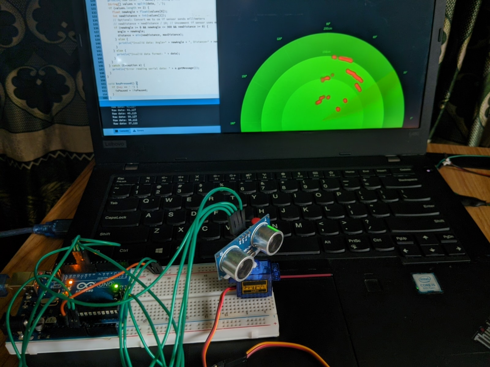

# Radar Visualization Project

<p align="center">
  
  <br>
  <strong>Arduino Uno based mini radar project</strong>
</p>

This project creates a visually appealing radar display using Processing to visualize data from an Arduino-based radar system. It receives angle and distance data from a sensor (e.g., ultrasonic sensor with a servo) via serial communication and displays a dynamic radar interface with glowing effects, smooth animations, and an interactive HUD.

## Features
- **Dynamic Radar Display**: Shows a sweeping radar with concentric distance circles and angle markers.
- **Glowing Effects**: Detected objects are shown as red dots with a glowing halo and fading trail.
- **Smooth Animations**: Uses interpolation for fluid sweep motion and a trailing sweep effect.
- **Interactive Controls**: Press the **Spacebar** to pause/resume the radar.
- **HUD (Heads-Up Display)**: Displays real-time data including radar status, angle, distance, raw distance, and number of detected objects.
- **Error Handling**: Robust serial communication with debug output for troubleshooting.

## Requirements
### Hardware
- Arduino board (e.g., Arduino Uno)
- Servo motor (for sweeping the sensor)
- Ultrasonic sensor (e.g., HC-SR04) or similar distance sensor
- USB cable for serial communication

### Software
- **Processing**: Version 3 or later with the Serial library included.
- **Arduino IDE**: For uploading code to the Arduino.
- (Optional) Processing Sound library for audio feedback (requires a `beep.wav` file).

## Installation
1. **Processing Setup**:
   - Download and install [Processing](https://processing.org/download).
   - Copy the `EnhancedRadarDisplay.pde` file into a new Processing sketch.
   - Ensure the Serial library is available (included by default in Processing).

2. **Arduino Setup**:
   - Connect your Arduino with a servo and ultrasonic sensor.
   - Upload the following example Arduino code to send angle and distance data:

     ```cpp
     #include <Servo.h>
     Servo servo;
     const int trigPin = 9;
     const int echoPin = 10;

     void setup() {
       Serial.begin(9600);
       servo.attach(8);
       pinMode(trigPin, OUTPUT);
       pinMode(echoPin, INPUT);
     }

     void loop() {
       for (int angle = 0; angle <= 180; angle += 5) {
         servo.write(angle);
         int distance = getDistance();
         Serial.print(angle);
         Serial.print(",");
         Serial.println(distance);
         delay(50);
       }
       for (int angle = 180; angle >= 0; angle -= 5) {
         servo.write(angle);
         int distance = getDistance();
         Serial.print(angle);
         Serial.print(",");
         Serial.println(distance);
         delay(50);
       }
     }

     int getDistance() {
       digitalWrite(trigPin, LOW);
       delayMicroseconds(2);
       digitalWrite(trigPin, HIGH);
       delayMicroseconds(10);
       digitalWrite(trigPin, LOW);
       long duration = pulseIn(echoPin, HIGH);
       int distance = duration * 0.034 / 2; // Distance in cm
       return distance;
     }
     ```
     or you can use radar.ino code.

3. **Optional Sound**:
   - Install the Processing Sound library via `Sketch > Import Library > Add Library`.
   - Uncomment sound-related lines in `EnhancedRadarDisplay.pde`.
   - Add a `beep.wav` file to the sketch’s `data` folder.

## 🔧 Final Connections

### HC-SR04
  - VCC → 5V (left side)
  - GND → GND (left side)
  - TRIG → Pin 9 (right side)
  - ECHO → Pin 10 (right side)
### Servo
  - Red (VCC) → 5V (left side)
  - Brown (GND) → GND (left side)
  - Orange (Signal) → Pin 11 (right side)

## Image


## Usage
1. Connect the Arduino to your computer via USB.
2. Open the `EnhancedRadarDisplay.pde` sketch in Processing.
3. Verify the serial port in the code (`Serial.list()[0]`) matches your Arduino’s port (e.g., `"/dev/ttyACM0"` or `"COM3"`).
4. Run the sketch. The radar will display:
   - Green concentric circles (distance markers in cm).
   - Angle markers every 30°.
   - A sweeping green line with a trailing effect.
   - Red dots for detected objects (with glow and fading trail).
   - A HUD showing angle, distance, raw distance, and object count.
5. Press **Spacebar** to pause/resume the radar.
6. Check the Processing console for debug output if issues arise.

## Configuration
- **maxDistance**: Set to 200 cm by default. Adjust in the code if your sensor has a different range.
- **radarRadius**: Set to 400 pixels. Modify for a larger or smaller display.
- **minDistance**: Set to 5 cm to filter noise. Increase if objects appear too close to the center.
- **Millimeter Support**: If your sensor sends distances in millimeters, uncomment `newDistance = newDistance / 10` in `serialEvent`.

## Troubleshooting
- **Red dots appear too close**: Check the Processing console for "Raw data" output. If distances are small (e.g., 10–50), your sensor may be sending millimeters. Uncomment the millimeter conversion line.
- **No data received**: Ensure the Arduino is sending data in the format `angle,distance\n` (e.g., `45,100\n`). Verify the serial port.
- **Sketch freezes**: Check for serial errors in the console. Ensure the Arduino is connected and the correct port is selected.
- **Objects not appearing**: Confirm the sensor’s range and calibration. Adjust `minDistance` or `maxDistance` if needed.

## Contact
  - Mehedi Hasan
  - [mehedi-2022415897@cs.du.ac.bd](mailto:mehedi-2022415897@cs.du.ac.bd)
